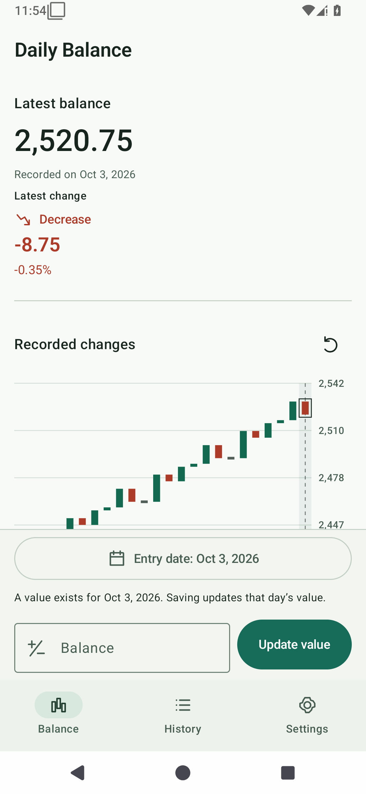
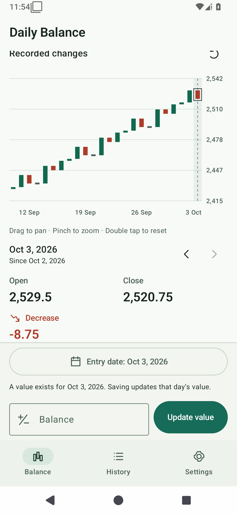
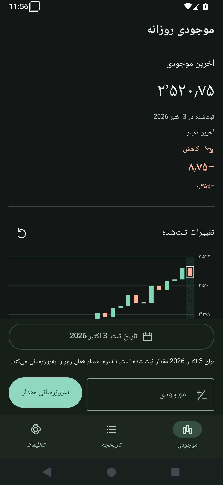

# Daily Balance

An offline Android app for recording one numerical value per calendar date and seeing how it changes. Use it for a personal balance or another quantity you want to follow over time. No account, market feed, or network connection is needed.

## Screenshots

Captured from the running app on an Android 15 / API 35 emulator with **synthetic demonstration values**. The chart-details view is scrolled to the selected record.

<p>
  
  
  
</p>

## Recording and reading changes

The Balance screen keeps date selection, the value field, and Save within reach. Choose an earlier date to fill a gap. If that date already has a record, **Update value** explicitly replaces it. History offers individual edits, confirmed deletion with undo, and either chronological order.

Each candle represents two **recorded** values:

- **Open:** the previous recorded value.
- **Close:** the value on the selected candle's actual date.
- **Change:** Close minus Open.
- **Percentage:** change / absolute value of Open × 100. It is undefined when Open is zero.

The chart draws bodies only. There is no high/low data and no fabricated shadow. An unchanged value is a horizontal mark. The first record establishes a starting point; a second date creates the first candle. Missing days remain missing: candles are evenly spaced by record, and their labels and details use the stored dates.

Drag horizontally to pan, pinch to zoom, and double tap or press Reset to return to the latest 24 changes. Zoom shows 4–365 candles where available. Previous/next buttons expose every selected candle's date, Open, Close, and change without requiring a chart gesture. The visible range is padded automatically; extreme scales can show an explicitly labeled axis offset so small differences remain readable.

## Features

- Exact decimal values, including negative and zero values; one record per date.
- Immediate chart updates after additions, edits, deletion, undo, and imports.
- Latest balance and change, with an optional restrained summary of total change, 7/30-day change, and recorded extremes.
- UTF-8 CSV import preview and export through Android's document picker.
- English and Persian, including RTL navigation, localized numbers, and Gregorian dates in both languages.
- System, light, and dark themes; font scaling, keyboard insets, landscape, and navigation rails on wider windows.
- Transactional migration of the original SharedPreferences data, with a recovery export for every original slot.

Recent summary changes use the last record **on or before** the cutoff relative to the latest recorded date. They are omitted when a baseline is unavailable. These are historical comparisons, with no predictions or advice.

## Privacy and backups

Entries live in `daily_balance.db`, a Room database in the app's private device storage. Theme preferences use DataStore; Android/AppCompat manages the app language. Original legacy preferences are retained privately for recovery.

The app requests **no network, broad storage, or runtime permissions**. It has no Internet permission, analytics, advertising, telemetry, or cloud service. AndroidX declares an app-local signature permission to protect internal broadcasts; it grants no device-data access. The document picker grants access only to the files you choose. An exported file belongs to the location/provider you select; choosing a cloud document provider is your explicit action.

Automatic Android backup is disabled. Both legacy backup rules and Android 12+ cloud/device-transfer rules exclude app storage. Manufacturer transfer policies can vary. **Export a CSV before uninstalling, clearing app storage, changing signing keys, or moving devices**; uninstalling or clearing storage removes the private database and the recovery data. CSV files are plaintext, so choose their destination with care.

## Compatibility

Android **6.0 / API 23 or later**. The application ID remains `com.example.dailycandle` to preserve the prototype's upgrade path. An in-place upgrade also requires the same signing certificate as the installed APK; locally generated debug certificates and CI debug certificates are not interchangeable. No unowned domain is invented by this contribution.

The source update uses version code 5 / version name 1.5, following the archive's code 4 / name 1.4. It does not claim a new major release.

## Build

Install JDK 17 and an Android SDK with platform **37.0** and build tools **36.0.0**. Set `ANDROID_HOME` or create an ignored `local.properties` containing `sdk.dir`. Android Studio can install the SDK and synchronize the project. Accept the SDK licenses using the SDK tools.

```sh
./gradlew assembleDebug
./gradlew clean lintDebug testDebugUnitTest assembleDebug
```

On Windows, use `gradlew.bat` for the same tasks. The committed, checksum-verified Gradle wrapper supplies [Gradle 9.8](https://docs.gradle.org/9.8.0/release-notes.html); no global Gradle or archive extraction is needed. Dependency versions are centralized in [the version catalog](gradle/libs.versions.toml). The build uses stable AGP 9.4.1, Kotlin 2.4.20, Compose, Room, and DataStore; Kotlin is configured through AGP's built-in Kotlin support plus the matching Compose compiler plugin. See [AGP's compatibility requirements](https://developer.android.com/build/releases/agp-9-4-0-release-notes).

The debug APK is generated at `app/build/outputs/apk/debug/app-debug.apk`. CI runs lint, unit tests, and assembly from the tracked tree and uploads an APK artifact after success. APKs are not committed.

For the Compose workflow tests, start an emulator/device and run:

```sh
./gradlew connectedDebugAndroidTest
```

These tests use an isolated in-memory database; they cover quick entry, validation, same-date update, history edit/delete/undo, chart selection, gestures, and reset. Unit tests cover exact parsing, ordering, candle/percentage/summary math, chart bounds, legacy parsing, transactional migration/rollback, CSV validation, and duplicate policies.

## Architecture

```text
Compose screens/components → BalanceViewModel + SavedStateHandle
                           → BalanceRepository → Room
                           → DataTransfer → selected document URI
                           → UserPreferences → DataStore
```

- `domain/`: Android-independent daily entries, decimal validation, candle and summary calculations, chart coordinates, legacy parsing, and bounded CSV parsing.
- `data/`: Room entities/DAO/database, transactional operations and migration, preferences, and document I/O.
- `ui/`: ViewModel/state, home/history/settings screens, focused components, chart drawing/gestures, formatting, and Material 3 tokens.
- `MainActivity`: activity/locale/edge-to-edge setup and a small manual dependency-injection boundary through `BalanceApplication`.
- `app/schemas/`: committed Room schemas. Future database changes must supply and test an explicit migration; destructive fallback is not enabled.

[DESIGN.md](DESIGN.md) records the implemented native palette, typography, spacing, component behavior, and accessibility conventions for future screens.

Dates are `LocalDate` in the domain and epoch days in Room, never timestamps or display strings. Values are `BigDecimal`, persisted as lossless ASCII decimal strings. Floating point is used only for normalized rendering coordinates and chart gestures. Creation/update metadata supports conflict checks so a stale edit or undo cannot replace a newer record.

The ViewModel survives activity recreation; SavedStateHandle retains the draft, selected date, page, and pending undo across process recreation. Compose saves chart position and page-local state. A file-import preview can be selected again after process death; no data is written until it is reviewed and confirmed.

## Legacy migration

On first database initialization, the app reads the original `data` SharedPreferences keys `values` and `dates`. It accepts the prototype's ISO dates (`yyyy-MM-dd`), later slash dates (`yyyy/MM/dd`), and finite numeric strings including scientific notation.

- Pairing always uses the original array index. Invalid rows do not shift later dates.
- Invalid/nonfinite values, invalid dates, and unmatched slots are counted and excluded from the new records.
- For repeated dates, the **last valid legacy value** wins. Existing new-database records are preserved.
- Entries and a durable migration receipt are written in **one Room transaction**. A failed write rolls back both and can retry. A successful receipt prevents re-import, including after a user deletes a migrated entry.
- The old preferences are never erased. Settings shows the receipt and can export `index,original_date,original_value`, including invalid and unmatched slots. This recovery format is intentionally separate from the normal import format.

Decimal limits (320 whole digits, 340 decimal places) bound resource use while covering the entire finite range previously stored as `Double`. Conversion preserves the numeric string the prototype saved; it cannot recover precision the prototype had already lost.

## CSV format

```csv
date,value
2026-09-26,1000
2026-09-27,1003.125
2026-09-30,-2.75
```

Exports are chronological, use ISO calendar dates and canonical ASCII decimals, and are independent of the display language. Import expects the two named columns `date,value`; it accepts UTF-8 BOM, LF/CRLF, quoted single-line fields, and whitespace around values. Thousands separators, localized digits, nonfinite numbers, invalid dates, and malformed quoting are rejected. Scientific notation is accepted within the decimal limits; exports always use plain decimals. Multiline CSV records are not supported.

Import first shows the number of valid/problem rows and row-specific errors (up to 100 shown). Within a file, the **first valid row** for a date wins; later duplicates are reported. Existing app values are **kept by default**. Replacing them requires choosing the explicit replacement option. All accepted rows are applied in one transaction. Header errors or exceeding 50,000 data rows, 5 million characters, or 1,024 characters per line reject the entire file; no partial import is applied.

For interactive entry, English, Persian, and Arabic digits are accepted. A dot, comma, or Arabic decimal separator may represent decimals, but grouping separators are not guessed. Displayed values follow the UI locale; stored and exported values always use a dot.

## Contributing and repository history

See [CONTRIBUTING.md](CONTRIBUTING.md) for checks and conventions. User-facing copy belongs in both `values/strings.xml` and `values-fa/strings.xml`. Translate full messages with placeholders rather than assembling sentence fragments in code.

The root `DailyCandle_TradingView_*.zip` files remain **legacy snapshots**. They are retained to avoid an unrelated binary-deletion diff. They are not build inputs: develop, review, and build the normal tracked source tree. Do not publish another ZIP as the source of truth.

No license is currently included in this repository. This contribution does not choose one on the maintainer's behalf.
